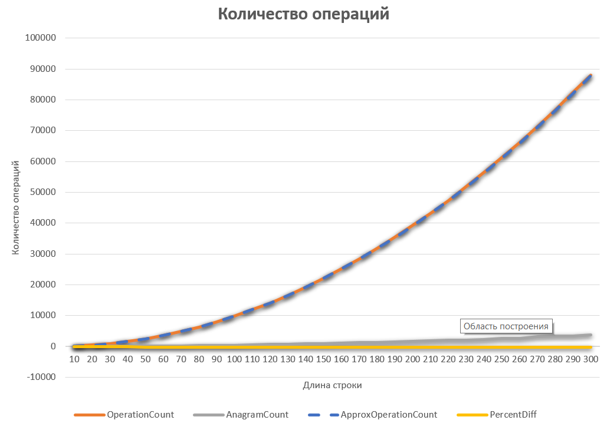
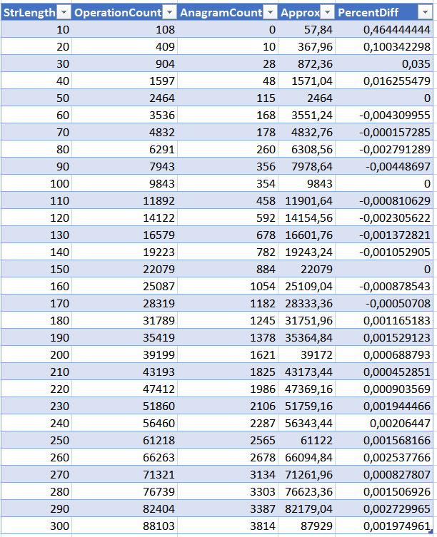

# AnagramCount

Этот файл содержит решение второй задачи о подсчете анаграм в строке. 

При парном программировании онлайн было сделано переборное решение  
сложности N^4 (в четвертой степени). Ниже решение, которое показывает квадратичную зависимость от длины входной строки. В решении выведена сложность решения - теорерически обяснено, почему она квадратичная.
Также квадратичная сложность решения подтверждается тестами. К решению приложен график с результатами запусков.
При запуске решение выводит данные, полностью подтверждающиме квадратичную зависимость.

Ниже привожу график зависимости количества операций от длины входной строки:


Данные работы программы, на которых был построен график:


Описание столбцов таблицы:
* StrLength - длина входной строки где будут искаться анаграммы
* OperationCount - количество операций в алгоритме
* AnagramCount - количество найденных анаграм
* Approx - количество операций, рассчитанных с помощью апроксимированной формулы параболы ```y=0.9714*x^2+1.87*x-58```
* PercentDiff - процент отклонения количества операций, которые вернула программа, от апроксимированной формулы параболы. Отклонение в среднем не превышает 0.2% 

## Описание алгоритма
Шерлок и Анаграммы

Две строки являются анаграммами друг друга, если буквы одной строки можно переставить, чтобы 
получить другую строку. Дана строка, найдите количество пар подстрок этой строки, которые 
являются анаграммами друг друга.

Примеры анаграм: ```abc acb bca bac cab cba```

Описание алгоритма:

Два слова являются анаграммами друг друга, если одно слово может быть получено из другого путем смены порядка символов. Реверс слово является лишь частным случаем анаграммы.

Очевидно, что у всех анаграмм одного и того же слова является неизменной одна характеристика: набор символов, встречаемых в анаграмме и количество встречаемости каждого символа в анаграмме. Это своего рода детерминант анаграммы. Понятно, что если мы отсортируем все символы в анаграмме по возрастанию, мы тоже получим детерминант анаграммы.

В этой программе для получения детерминанта анаграммы мы будем использовать сортировку.
Две строки являются анаграммами друг друга, если результаты сортировки каждой из них равны.

Алгоритм:
```
Объявляем целое число anogramSum = 0;

Внешний цикл: идем по длине подстроки len = от 1 до (длина входной строки -1).
{
    Создаем ассоциативный массив map<string, long>.
    в этом массиве мы будем накапливать детерминанты анаграммы и 
    сколько раз они встретились в исходной строке.
    
    Первый вложенный цикл: 
    мы берем последовательные подстроки входной строки длиной переменной 
    len из внешнего цикла
    {

        Каждую такую подстроку мы сортирует во возрастанию по символа - 
        получаем детерминант строки.
        И увеличиваем значение map[детерминант]++;

        цель - подсчитать прямое количество, сколько раз детерминант 
        анаграммы встречаются в строке
    }
    
    Второй вложенный цикл.
    Идем по всем элементам ассоциативного массива map (по всем анаграммам)
    {
        Расчитываем количество пар для текущей арангаммы.
        У нас есть общее количество встречаемости анаграммы N.
        Количество пар: (N-1)+(N-2)+ ... +1

        (1 + (N-1))
        ----------- (N-1) = N*(N-1)
             2

        Это арифметическая прогрессия, сумма которой = N*(N-1)/2
        При операциях приводить к дробному и округлять не надо, 
        т.к. сумма целых всегда целая.
        А также потому, что из двух последовательных чисел (N-1) и N четное. 

        anogramSum += КоличествоПар
    }
}

вернуть anogramSum 
```

## Оценка сложности алгоритма
Внутри алгоритма есть внешний цикл и два вложенных цикла. Поэтому оценка сложности N^2.
Я сделал вывод количества операций, количества анаграм и длины строки в таблицу значений (см. выше). Строки для оценки сложности формировались случайным образом из алфавита a-z.
На графике видна парабола ```y=0.9714*x^2+1.87*x-58```.

Коэффициенты я рассчитал исходя из реальных данных, которые вернула программа: парабола задается тремя точками. Я взял данные в точках ```(50;2464), (100;9843), (150;22079)```, решил систему из трех линейных уравнений и получил коэффициенты. 

Общий вид параболы: ```a*x^2 + b*x + c = y```

Вот система уравнений, составленная по значениям в точках: 
```(50;2464), (100;9843), (150;22079)```

```
a*50^2+b*50+c=2464              // (50;2464)
a*100^2+b*100+c=9843            // (100;9843)
a*150^2+b*150+c=22079           // (150;22079)
```

Решение этой линейной системы из трех уравнений дает значения коэффициентов:
```
a=0.9714
b=1.87
c=-58
```

Отсюда получаем уравнениепараболы ```y=0.9714*x^2+1.87*x-58```, которая весьма точно апроксимирует данные, полученные из запусков функции.

Как видно на графике, парабола наложилась на график: 
* рыжая кривая = график, построенный по данным работы программы
* синяя прерывистая кривая - график апроксимирующей параболы
По графикам наглядно видно, что синие штрихи идут поверх рыжих. Это значит, что наше теоретическое предположение, что сложность программы квадратичная, подтверждается практическими данными, т.к. мы нашли такую параболу, которая с точность 0.2% апроксимирует данные выполнения программы.  

## Автотесты
Решение содержит тесты, где введены все примеры входных данных и ожидаемые результаты работы программы, которые совпали. Все тесты автоматически запускаются при запуске программы. 

График посроен с помощью таблицы Excel. 
[Вот ссылка на таблицу Excel с данными и графиком](Doc/AmogramStatistics.xlsx)

ОПЫТНЫМ ПУТЕМ ВЫЯСНИЛ, ЧТО ЭТО РЕШЕНИЕ ДАЕТ КВАДРАТИЧНУЮ ЗАВИСИМОСТЬ ОТ КОЛИЧЕСТВА ДАННЫХ И ОПРЕДЕЛИЛ ТОЧНЫЙ ВИД ЭТОЙ ЗАВИСИМОСТИ.
ЦЕЛЬ ДОСТИГНУТА ПОЛНОСТЬЮ!!!

